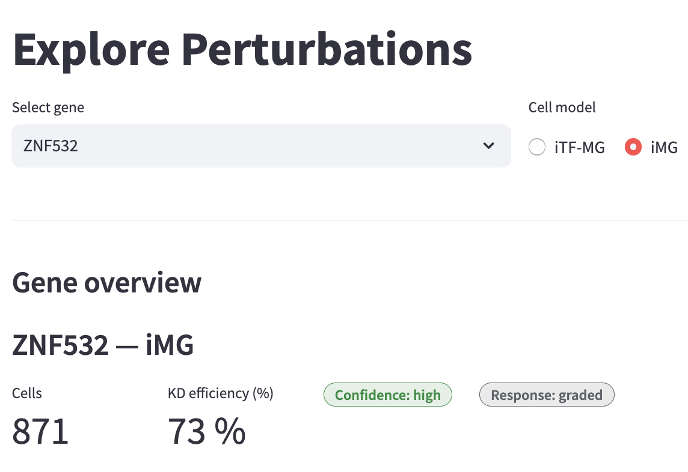
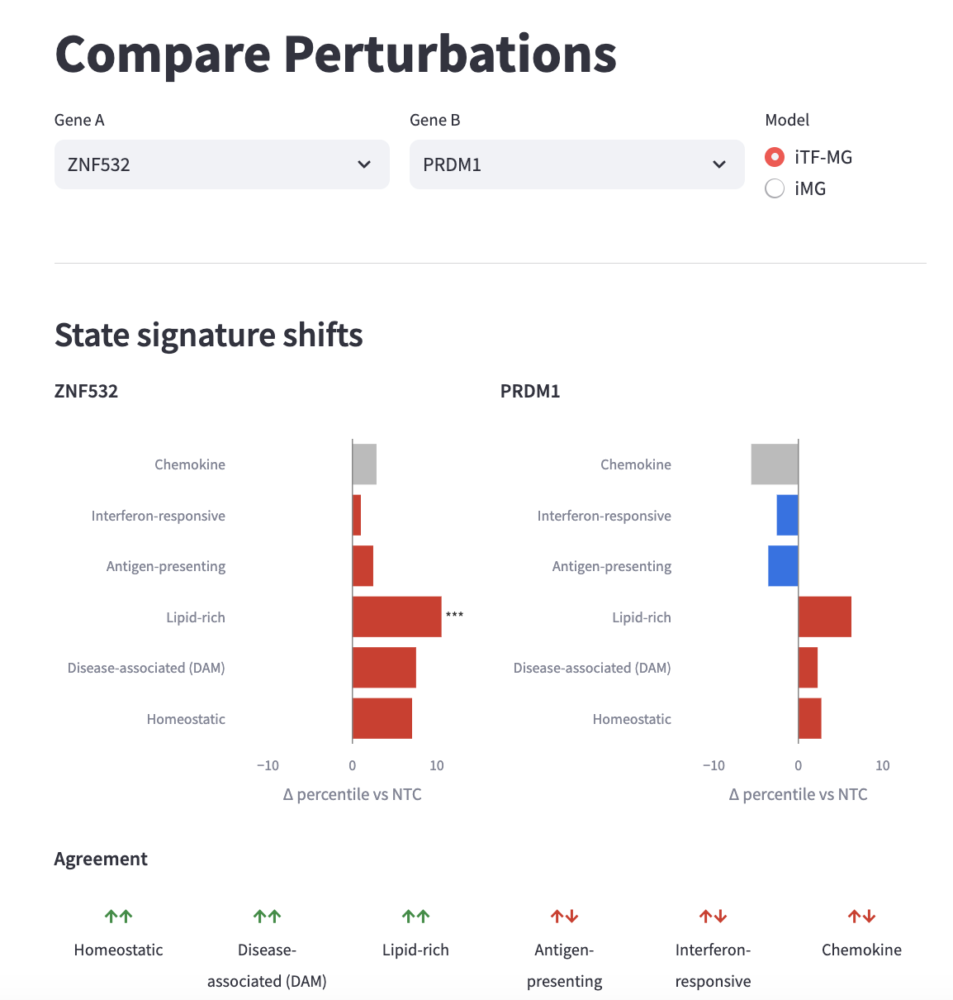
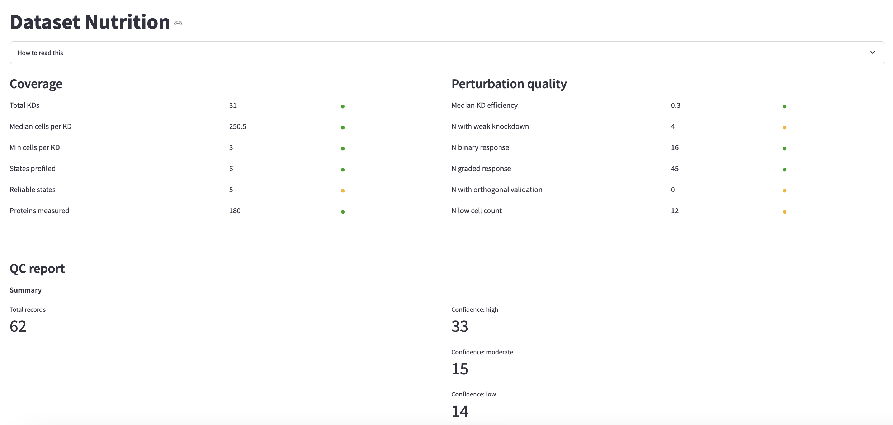
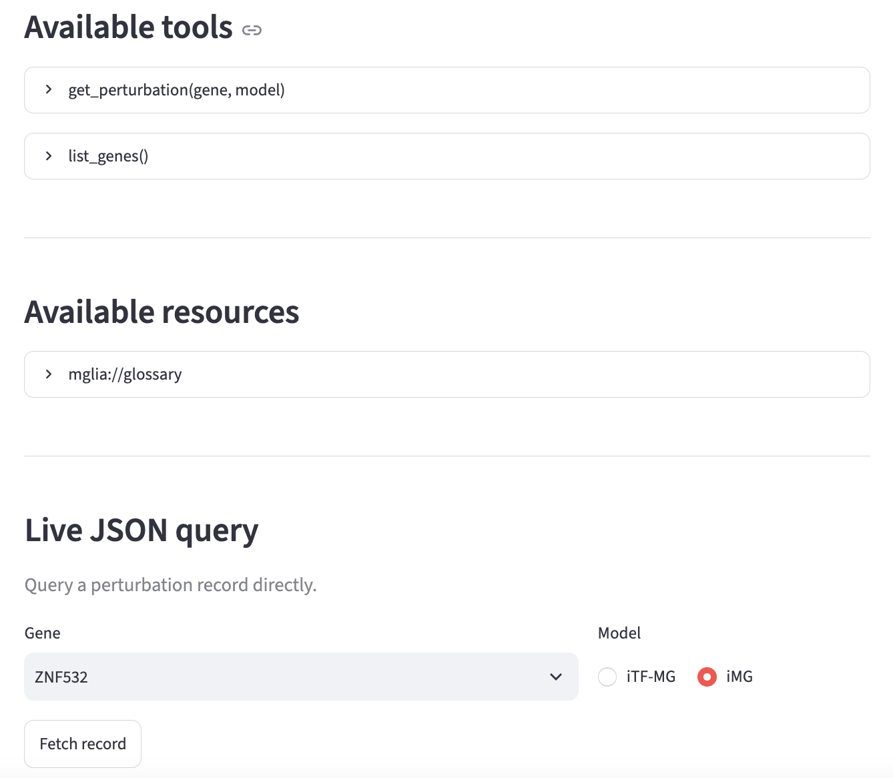
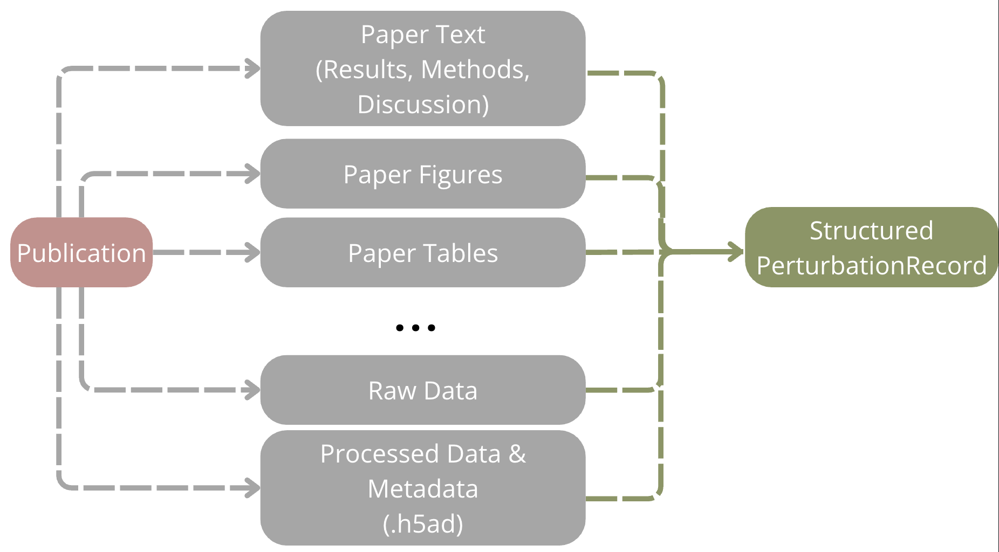
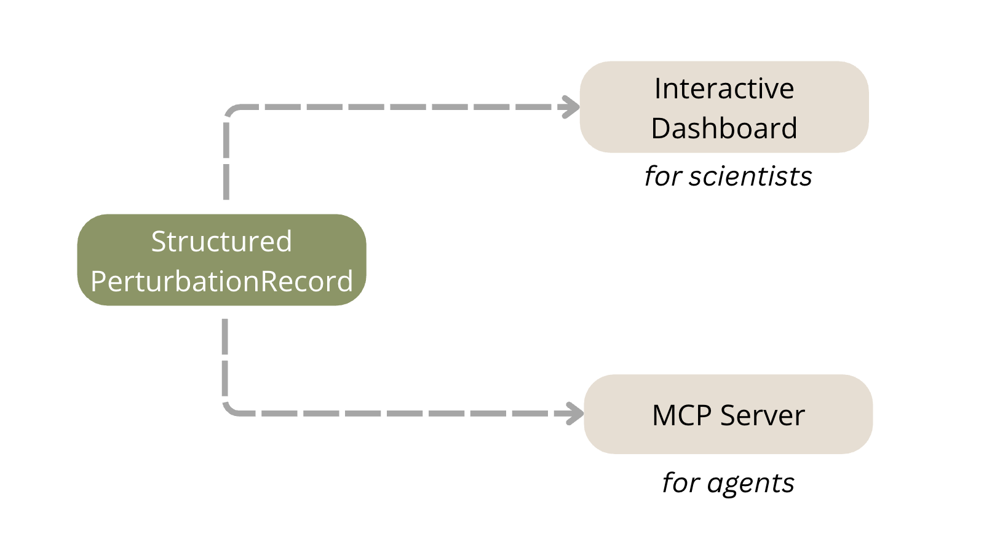

# Microglia Regulators Dashboard and Explorer

Wondering where to get started on exploring our multi-omic CRISPRi perturbation microglia dataset? You can download all the raw data on GEO: [GSE335887](https://www.ncbi.nlm.nih.gov/geo/query/acc.cgi?acc=GSE335887) but if you just have a question, want to explore all our knockdowns in the paper, or want your agent do it for you, you're in the right place!


Here is a dashboard for exploring CRISPRi perturbation data from McQuade et al. 2026, covering
31 transcription factor knockdowns across two human iPSC-derived microglia models
(iTF-MG and iMG). Each perturbation record includes signature shifts across 6 microglial
states, top differentially expressed genes, scHPF factor activity, functional assay
readouts, and a per-record assumption audit. A companion MCP server exposes the same
data to AI agents so you can query the entire dataset without any code.


## Quickstart

| If you want to                                         | For      | Go to Page                                                                    |
| ------------------------------------------------------ | -------- | ----------------------------------------------------------------------------- |
| See everything known about one perturbation            | Humans   | [**Explore Perturbations**](https://mglia-regulators-explorer.streamlit.app/explore)                                                     |
| Ask whether two perturbations do the same thing        | Human    | [**Compare Perturbations**](https://mglia-regulators-explorer.streamlit.app/compare)                                                     |
| Decide whether to trust this dataset for your question | Human    | [**Dataset Nutrition**](https://mglia-regulators-explorer.streamlit.app/nutrition_label)                                                         |
| Let an LLM query the dataset for you                   | AI Agent | [**Agentic Exploring**](https://mglia-regulators-explorer.streamlit.app/agent)                                                         |
| Get the raw sequencing data                            | Both     | [GEO: GSE335887](https://www.ncbi.nlm.nih.gov/geo/query/acc.cgi?acc=GSE335887) |
| Reproduce the analysis                                 | Both     | [Paper Official Repo](https://github.com/reetm09/mglia_regulators_paper)
| Read the paper                                         | Both     | [McQuade et al., 2026](https://www.cell.com/neuron/fulltext/S0896-6273(26)00530-1)


## Example questions to ask via Agent
Ordered from simpler to more complex queries
 - What are the Top DEGs in ZNF532 in iMG?
 - What states does STAT2 affect in iTF-MG?
 - What are scHPF factors?
 - Which are the top regulators of the interferon state?
 - Compare ZN532 to PRDM1
 - Which genes regulate phagocytosis?
 - Which genes have both transcriptomic and experimental evidence?
 - What are the high confidence perturbations? Why?
 - I know that TREM2 regulates the DAM state, are there any other perturbations similar to this gene?


## Local Installation
1. Clone Repo
```bash
git clone https://github.com/reetm09/mglia-regulators-explorer.git
cd mglia-regulators-explorer
```

2. Start Virtual Environment
```bash
uv venv .mglia-env   # or use an existing venv/conda env
source .mglia-env/bin/activate
uv pip install -r requirements.txt
streamlit run home.py
```

## Pages

- **Explore Perturbations** (`pages/1_explore.py`) — gene search, assumption audit, signature
  shift bars, top DEGs, functional readouts, scHPF factors, downloads.

  

- **Compare Perturbations** (`pages/2_compare.py`) — two knockdowns side by side, plus a full
  gene × state heatmap across all 31 knockdowns.

  

- **Dataset Nutrition** (`pages/4_nutrition_label.py`) — the dataset nutrition label
  (coverage, perturbation quality, model-evaluation readiness) plus an inline QC report
  (summary counts and confidence-tier plots).

  

- **Agentic Exploring** (`pages/5_agent.py`) — MCP connection instructions (local + remote)
  and a live JSON query interface.

  

- **About** (`pages/6_about.py`) — dataset background, details and citation.

See `docs/DESIGN_DECISIONS.md` for the full walkthrough and key design decisions for components.

## Agentic Exploration / MCP Access

The MCP server (`mglia/mcp_server.py`) exposes `get_perturbation` and `list_genes` as tools,
plus a `mglia://glossary` resource. See `pages/5_agent.py` or the `Agentic Exploration` Page on
the dashboard for installation instructions.

## Architecture Decisions

Per-perturbation information is often separated across processed data files, figures, supplementary materials, methods, and paper text. The molecular measurements may be in an .h5ad, while experimental results, validation, orthogonal characterizations, functional readouts and method assumptions live in the paper or needs to be re-derived even for result interpretation.

Generating a structured JSON PerturbationRecord for each knockdown, the smallest unit in this dataset, allows for unification of published results derived from both computational and experimental work. This is one approach to enable each perturbation to carry not only results but also caveats and limitations that may not be as obvious to AI agents when accessing the dataset.



Using PerturbationRecord as the base I display data in an interactive dashboard designed primarily for human scientists and through an MCP server with tools like `getPerturbtaion` or `listGenes`, and with a `Glossary` resource for AI agents to interrogate the dataset, ensuring results across methods are carried through. 



See `mglia/schema.py` for more details on PerturbationRecord. Currently optimized for this dataset, many fields are optional can be defined differently across other transcriptomic perturbation datasets. 

## Citation

<!-- CITATION:START -->

**Full**

McQuade, A., Mishra, R., Hagan, V., Liang, W., Colias, P. J., Castillo, V. C., Gonzalez, B., Lubin, J. P., Haage, V., Marshe, V., Fujita, M., Ta, T., Gomes, L., Teter, O., Han, X., Robichaud, N., Chasins, S. E., Rexach, J. E., De Jager, P. L., Nuñez, J. K., Kampmann, M. (2026). Transcriptional regulation of disease-relevant microglial activation programs. Neuron 10.1016/j.neuron.2026.07.001


**Short**

McQuade et al., Transcriptional regulation of disease-relevant microglial activation programs, Neuron (2026), 10.1016/j.neuron.2026.07.001
    
**Code**

GitHub [Link](https://github.com/reetm09/mglia-regulators-explorer) • Email reet.mishra@ucsf.edu if you have any questions, or issues. Feedback is also always welcome!
<!-- CITATION:END -->


